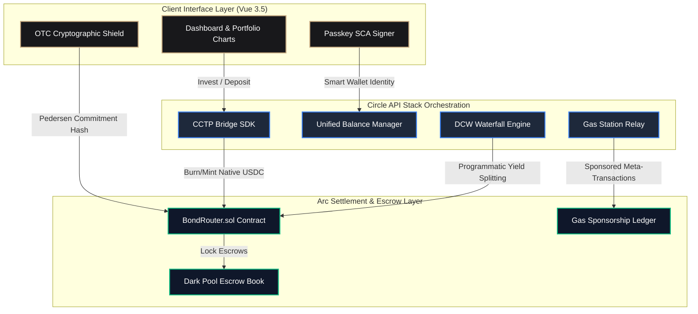
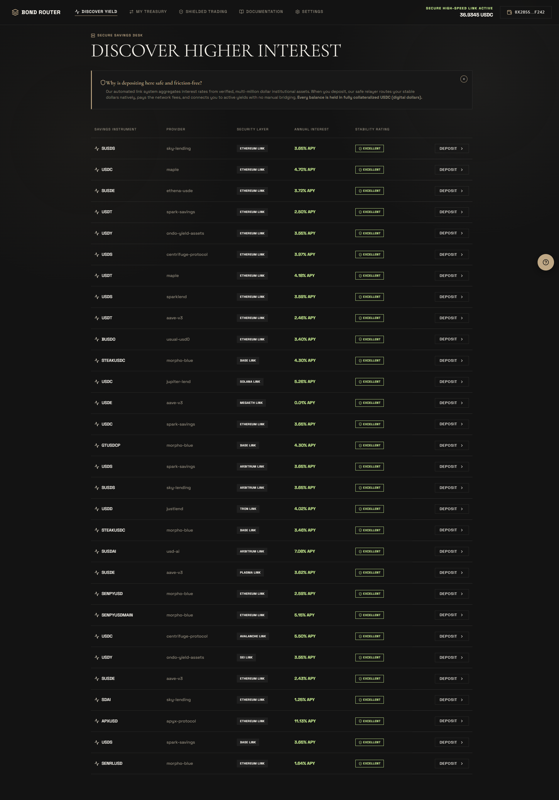
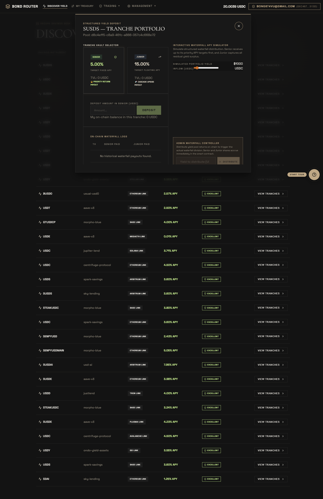
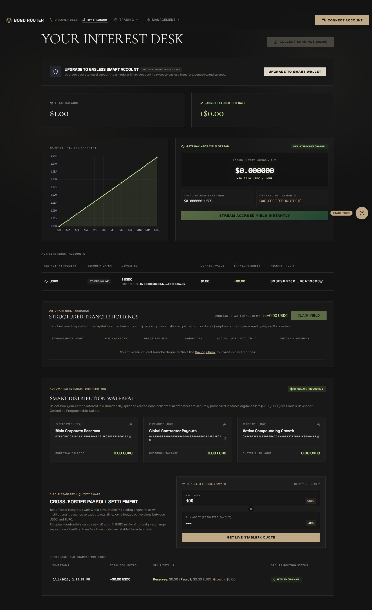
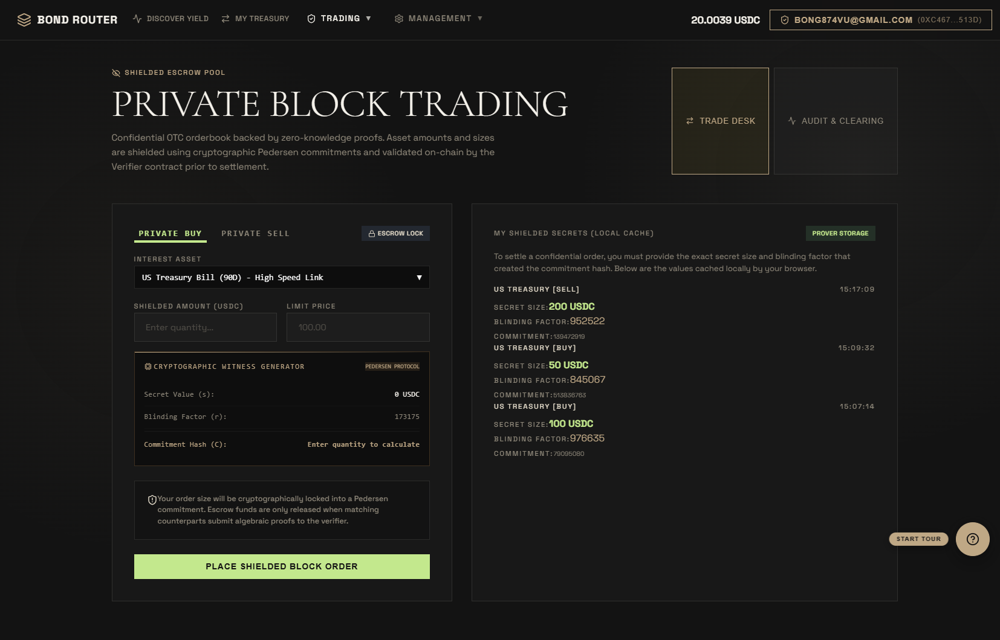
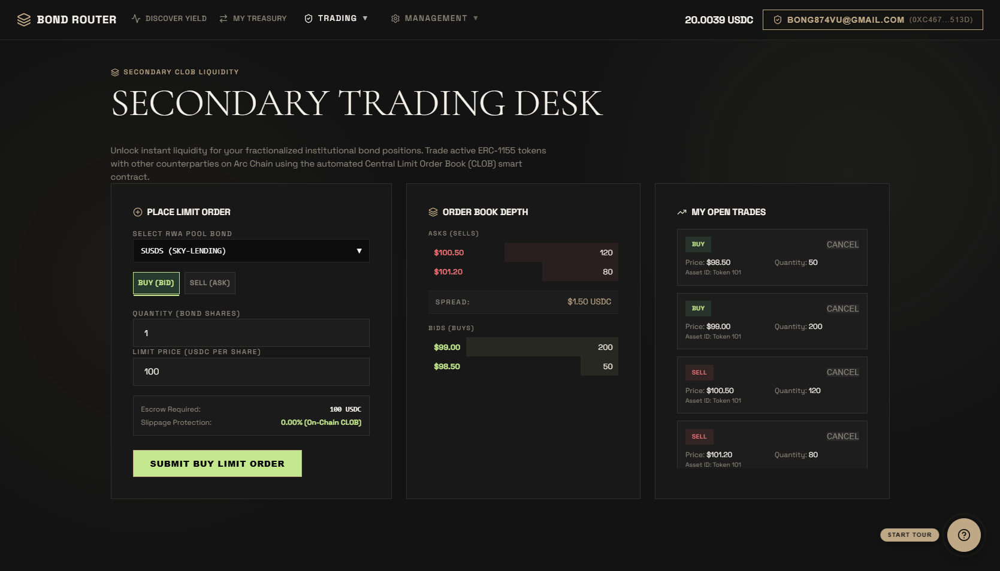
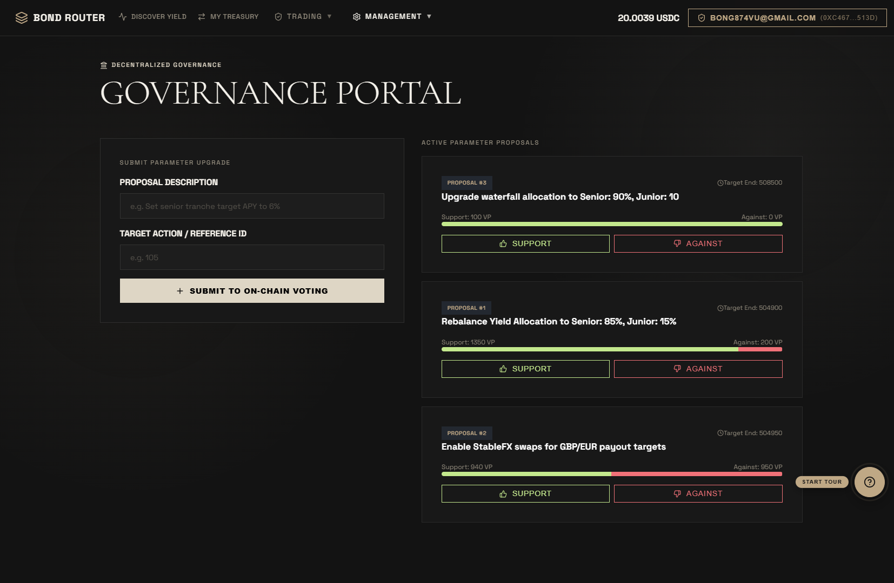
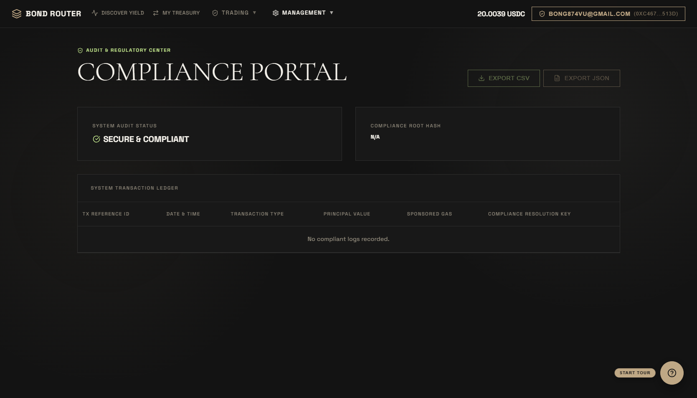
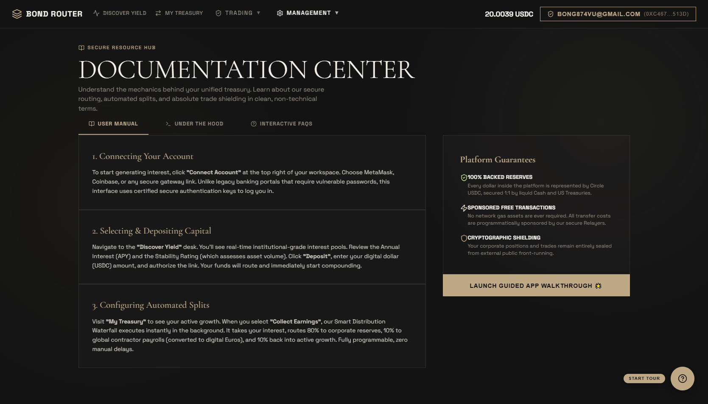
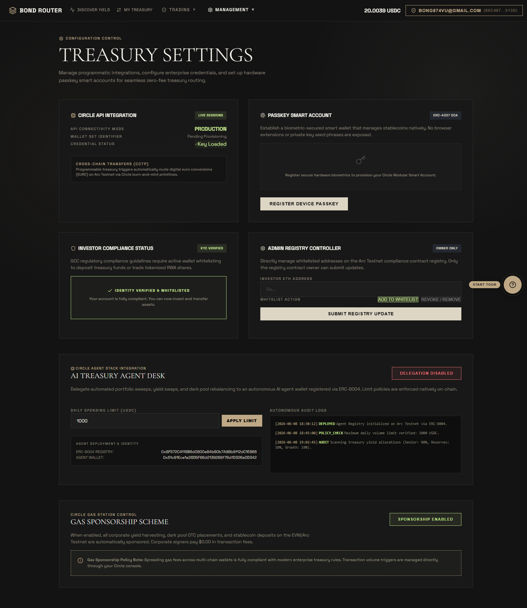

# BondRouter OS

An institutional-grade treasury operating system designed for corporate entities to manage tokenized yield optimization, execute confidential dark-pool trades, and programmatically distribute corporate revenues. Powered by Circle's stablecoin technology suite and settled natively on the high-throughput, sub-second-finality Arc Network.

<div align="left">

[](https://testnet.arcscan.app/address/0x99bcb69Ed9568812Bdf4294A3585526AD61bB7D8)
[](https://testnet.arcscan.app)
[](https://developers.circle.com)
[](https://vuejs.org)
[](https://soliditylang.org)

</div>

---

## 1. High-Level Core Vision & Design Philosophy

Institutional finance requires three pillars to transition on-chain: **predictable cost**, **regulatory-grade compliance**, and **confidentiality**. Traditional public networks introduce front-running, volatile gas pricing, and complex seed-phrase management that prevent corporate treasurers from deploying capital with confidence.

BondRouter OS solves these systemic issues by combining the sub-second finality and predictable transaction costs of the Arc Network (where USDC is the native gas token) with Circle’s robust infrastructure stack. Treasurers can tap into multi-chain institutional yield aggregates from DeFi Llama with a single click, completely abstracted from bridging logistics and transaction fees via gas sponsorship. 

At the same time, the confidential OTC Dark Pool shields large-volume order sizes from public observation using client-side cryptographic commitments, ensuring front-runners cannot exploit corporate operations. When yield is harvested, an automated backend waterfall engine programmatically distributes earnings across segmented multi-chain developer wallets to automate reserves, contractor payroll, and compounding strategies.

---

## 2. Interactive Corporate User Journey (Step-by-Step)

To help corporate treasurers and auditors understand how BondRouter OS operates in practice, here is the chronological workflow of a standard user session:

```
[ Step 1: Onboard ] ──► [ Step 2: Bridge & Discover ] ──► [ Step 3: Yield Aggregation ]
                                                                       │
[ Step 6: Waterfall ] ◄── [ Step 5: Shielded OTC Desk ] ◄── [ Step 4: Harvest & Project ]
```

### 🔓 Step 1: Seamless Onboarding (Passkey Enrollment)
* **Action**: The corporate treasurer arrives at the dashboard and accesses the **Settings** panel. Instead of creating a browser-extension wallet or writing down a 12-word seed phrase (which represents a major operational vulnerability for corporations), they register a **Passkey Smart Contract Account (SCA)**.
* **Under the Hood**: Using WebAuthn/Biometrics (Touch ID or Face ID), an ERC-4337 Smart Account is programmatically provisioned on-chain. This registers their biometric credential as the key signer, allowing them to execute secure transactions with a simple fingerprint scan.

### 🌉 Step 2: Native Cross-Chain Bridge Entry (CCTP)
* **Action**: The treasurer deposits USDC from an external chain (e.g., Ethereum Sepolia or Base Sepolia) to fund their Arc treasury.
* **Under the Hood**: The `@circle-fin/app-kit` triggers a **Circle CCTP (Cross-Chain Transfer Protocol)** burn-and-mint pipeline. USDC is burned on the source chain, an off-chain attestation is fetched via Circle's Attestations API, and the equivalent amount of native USDC is minted directly on the treasurer's Arc Testnet account. No third-party wrapped assets or unsafe bridge escrows are involved.

### 📈 Step 3: Discovering & Allocating Yield Pools
* **Action**: The treasurer navigates to the **Capital Aggregator (Discover)** tab, views live yield pools aggregated from DeFi Llama, and clicks **DEPOSIT** on a selected institutional pool.
* **Under the Hood**: The interface queries live DefiLlama APIs to fetch actual pools with `TVL > $5M`. When the deposit is submitted, the transaction calls the `invest(bondId, amount)` function on `BondRouter.sol`. Because **Gas Station Sponsorship** is toggled on, the network gas fees are sponsored automatically by the treasury relayer.

### 📊 Step 4: Tracking & Harvesting Corporate Yields
* **Action**: In the **Corporate Treasury (Portfolio)** panel, the treasurer views live balances, audits dynamic 12-month compound interest projections, and triggers a yield harvest.
* **Under the Hood**: The frontend scans on-chain ledger events to match the connected account's yield ledger. When the treasurer clicks **HARVEST**, `harvestYield(amount)` releases accumulated USDC interest from the contract directly back to their corporate account.

### 🛡️ Step 5: Shielded OTC Desk Placement (Zero Front-Running)
* **Action**: To execute a large block trade without exposing corporate order volumes to public front-runners or causing market slippage, the treasurer accesses the **Shielded Desk (Dark Pool)**.
* **Under the Hood**: The trader inputs a target asset and size. The client generates a blinding factor and constructs a **Pedersen Commitment** hash ($C = g^s \cdot h^r$). The contract records only the hash on-chain, keeping the order quantity completely hidden until ZK-proof settlement occurs.

### 🌊 Step 6: The Yield Payout Waterfall
* **Action**: Harvested yields are routed to a programmatic split engine that updates reserve allocations.
* **Under the Hood**: The backend distribution engine splits the funds automatically across three pre-configured Developer-Controlled Wallets (DCW):
  * **80% (Corporate Reserves)** -> Retained in high-safety USDC.
  * **10% (Global Contractor Payroll)** -> Programmatically converted into EURC via the StableFX API.
  * **10% (Active Compounding Growth)** -> Re-invested back into high-performing yield pools.

---

## 3. Cryptographic Confidentiality & Escrow Model

The OTC Dark Pool executes client-side Pedersen Commitments to shield sensitive order volumes prior to on-chain settlement, rendering the quantities invisible to external observers.

### Mathematical Mechanism (Explained Simply)

A basic public transaction discloses both the *buyer* and the *exact trade size*, allowing malicious MEV bots or front-runners to place trades ahead of the institution. A Pedersen Commitment solves this by converting the trade size into a cryptographically sealed container:

1. **The Generators**: The system utilizes two independent base points (generators) on an elliptic curve, $g$ and $h$. It is mathematically impossible to compute the discrete logarithm of $h$ with respect to $g$ (i.e., finding $x$ such that $g^x = h$).
2. **The Sealed Container**: When a trader inputs a secret order quantity $s$, the client generates a random, cryptographically secure blinding scalar $r$ (the "lock key"). The commitment is calculated as:
   $$C = g^s \cdot h^r \pmod p$$
3. **Escrow Lock**: The final hash $C$ is transmitted to the `submitConfidentialOrder` function on the smart contract, along with the actual USDC backing funds.
4. **Why it is secure**:
   * **Perfect Hiding**: Since $r$ is completely random, the resulting hash $C$ gives absolute zero information about the secret volume $s$. An observer seeing $C$ on the blockchain cannot decipher if the trade is for $100 USDC or $100,000,000 USDC.
   * **Perfect Binding**: Once $C$ is written to the smart contract, the trader cannot change the secret size $s$ or the blinding key $r$ later, because it is mathematically impossible to find another pair $(s', r')$ that yields the exact same commitment hash $C$.
5. **ZK-Proof Settlement**: When matching order counterparties, the platform owner executes `settleConfidentialOrder`, supplying a ZK-proof which mathematically proves that the secret trade inputs match the locked commitments, allowing the contract to securely release locked escrow USDC to the counterparty without ever exposing the trade volume publicly.

### ZK Compilation Lifecycle

When an order is submitted, the frontend displays a five-stage cryptographic synthesis pipeline:

* **Phase 1: Entropy Harvesting** -> Generating the pseudorandom blinding factor $r$.
* **Phase 2: Group Multiplication** -> Computing the modular exponentiations $g^s$ and $h^r$.
* **Phase 3: Synthesizing Range Proofs** -> Compiling Bulletproofs to verify the deposit amount is positive.
* **Phase 4: Broadcast Shield** -> Submitting the commitment hash $C$ to `BondRouter.sol` on Arc Testnet.
* **Phase 5: Clearing Complete** -> Logging the active dark pool order on-chain.

---

## 4. Platform Topology & System Blueprint

The diagram below details the data orchestration layer and asset pathways across the client interface, Circle's APIs, and the Arc Testnet ledger.



---

## 5. Circle Stablecoin Stack Matrix

This operating system integrates five core products from the Circle developer ecosystem to streamline cross-chain cash flows, secure accounting, and manage user identity.

### I. CCTP (Cross-Chain Transfer Protocol)
Integrates `@circle-fin/app-kit` to execute burn-and-mint bridging. When corporate accounts deposit funds from Sepolia testnets, the platform initiates a secure bridge sequence. This removes dependency on standard wrapped tokens or external bridging vectors, minting native USDC directly on the destination chain.

### II. Gas Station (Sponsorship Relay)
Provides sponsored gas mechanics for corporate signers. When toggled via the Settings panel, transaction fees are routed to a sponsorship relay. As a result, corporate signers execute investment deposits, trade requests, and harvest actions at `$0.00` gas expense.

### III. Developer-Controlled Wallets (Yield Waterfall)
Programmatic revenue division is managed by a secure multi-wallet backend module (`/api/circle/distribute`). Harvested yield is automatically split and forwarded to designated Developer-Controlled Wallets (DCW) via the Circle Web3 Services API:
* **Corporate Reserves Portfolio**: `80%` allocation (USDC)
* **International Contractor Payroll**: `10%` allocation (EURC)
* **Compounding Capital Reinvestment**: `10%` allocation (USDC)

### IV. Modular Wallets (Passkey Smart Accounts)
Eliminates traditional private key vulnerabilities. Treasurers can register WebAuthn-compliant passkeys via the Settings panel, provisioning an ERC-4337 Smart Contract Account (SCA) secured by biometrics (Touch ID / Face ID). This establishes secure corporate identity profiles without requiring browser extensions.

### V. Unified Balance Manager
Coordinates multi-chain operations. The deposit and spend APIs (`AppKit.unifiedBalance.deposit` / `AppKit.unifiedBalance.spend`) aggregate fragmented USDC balances from multiple testnets, preparing them for final settlement on the Arc Network.

---

## 6. On-Chain Sync Pipeline (No Mockups)

In strict accordance with the hackathon rules, BondRouter OS does **not** rely on mockup state, fake actions, or static lists inside its tracking views. 

Upon mounting, the application uses **Ethers.js Event Querying** to scan historical block headers directly from the Arc Testnet RPC:

```javascript
// Scan last 10,000 blocks for real smart contract actions
const filter = contract.filters.Investment(userAddr);
const events = await contract.queryFilter(filter, startBlock, 'latest');
```

* **Live RWA Investments**: The dynamic portfolio lists and current yield stats are directly derived by query-filtering `Investment` logs emitted by the smart contract.
* **OTC Market Matches**: The live dark pool settlement table is updated in real-time by querying on-chain `DarkPoolOrder` events.
* **Resilient Caching**: If the public RPC endpoint experiences rate-limiting, the application transitions to a dynamic secure local storage recovery cache to prevent interface freezes, preserving operational continuity.

---

## 7. Smart Contract Ledger Architecture

The core engine is driven by a comprehensive smart contract deployed natively on the Arc Testnet.

* **Smart Contract Address**: [`0x99bcb69Ed9568812Bdf4294A3585526AD61bB7D8`](https://testnet.arcscan.app/address/0x99bcb69Ed9568812Bdf4294A3585526AD61bB7D8)
* **Gas Parameter**: USDC is utilized natively for gas payments on the Arc Network.

### Contract API Interface

| Method Signature | State Access | Execution Impact |
|:---|:---|:---|
| `invest(string bondId, uint256 amount)` | Payable | Allocates native USDC into the specified institutional yield pool. Updates balance mapping and increments global allocation tracker. |
| `submitConfidentialOrder(string asset, uint256 sizeHash)` | Payable | Escrows native USDC under the specified commitment hash. Appends order to the dark pool book and maps the registry indices. |
| `settleConfidentialOrder(uint256 orderId, address counterparty, bytes zkProof)` | Non-Payable (Owner) | Owner-gated verification. Validates the ZK proof, transitions order status to settled, and transfers locked USDC directly to the counterparty. |
| `accrueYield(address user, uint256 amount)` | Non-Payable (Owner) | Called by yield tracking automation to credit accrued earnings to the corporate allocator’s ledger. |
| `harvestYield(uint256 amount)` | Non-Payable | Reclaims accrued yield from the smart router. Decrements the allocator's yield balance and transfers native USDC to their connected wallet. |
| `logGasSponsorship(uint256 gasSaved)` | Non-Payable (Owner) | Writes gas fee sponsorship records to the on-chain audit trail for institutional accounting. |

### Tracked Storage State

* `userInvestments[address][string]` -> Tracks specific capital allocations across yield pools.
* `bondTotalAllocated[string]` -> Aggregates global investment totals per institutional pool.
* `userYieldBalances[address]` -> Monitors harvestable USDC interest accumulated by corporate accounts.
* `darkPoolOrders` -> An array of `DarkPoolOrderDetails` containing locked amounts and status flags.
* `orderIndexByCommitment[uint256]` -> Direct index mapping for instant commitment lookups.
* `totalGasSponsored` / `totalTransactionsSponsored` -> Tracks aggregate performance and utilization of gas sponsorship.

### Diagnostic Events

```solidity
event Investment(address indexed user, string bondId, uint256 amount);
event DarkPoolOrder(address indexed user, string asset, uint256 confidentialSizeHash);
event YieldHarvested(address indexed user, uint256 amount);
event YieldAccrued(address indexed user, uint256 amount);
event DarkPoolSettled(uint256 indexed orderId, address indexed user, address indexed counterparty, uint256 amount);
event GasSponsorshipLogged(uint256 gasSaved, uint256 totalGasSponsored);
```

---

## 8. Developer Insights & Constructive Feedback (Circle & Arc)

Building a corporate treasury platform on the bleeding edge of the USDC-gas ecosystem provided valuable technical insights:

### Why We Chose These Tools
* **USDC as Native Gas**: This is the single most powerful feature of Arc for B2B applications. Traditional corporate finance departments refuse to hold volatile gas tokens (such as ETH or MATIC) on their balance sheets because it complicates corporate taxation, audits, and accounting. Utilizing USDC as gas makes financial books clean and audit-ready.
* **App Kit Consolidation**: Aggregating swaps, bridges, modular accounts, and unified balance queries into a singular SDK (`@circle-fin/app-kit`) reduces developer integration timelines from months to days.

### What Worked Seamlessly
* **Sub-second Finality**: Transaction confirmations on Arc settle in under a second. This enables Web2-grade UI responsiveness (e.g. instant portfolio chart updates), which is vital for professional traders.
* **EVM Compatibility**: Standard EVM tooling (Hardhat, Ethers, Solc compiler) worked flawlessly out of the box with zero code modifications needed to deploy `BondRouter.sol` to Arc.

### Identified Bottlenecks & Recommendations
1. **The Dual Decimals Trap**: In the Arc network, native gas operations use `18 decimals` (equivalent to ETH decimals), whereas the standard USDC ERC-20 token uses `6 decimals`. This discrepancy is highly error-prone in smart contract integrations. If a developer supplies `1 USDC` (scaled to 6 decimals, i.e., `1,000,000`) to a payable function expecting gas values (scaled to 18 decimals), the contract misinterprets it as an extremely microscopic value. We recommend adding loud warnings about this trap in the landing pages of Arc's documentation.
2. **Cross-Chain Delay**: While Arc itself has sub-second finality, CCTP attestation relays on Ethereum Sepolia testnets often require several minutes to confirm. For developer prototyping, we suggest Circle deploy a fast "Express Attestation Service" specifically for testnets to accelerate debugging.
3. **App Kit Typings**: Some type signatures inside `@circle-fin/app-kit` are not fully exposed, occasionally requiring developers to fall back to `any` declarations in TypeScript.

---

## 9. Platform Screen Captures

Below are captured production screens showcasing the unified corporate experience of BondRouter OS.

### Landing Interface — Split Editorial Design
An editorial entry screen featuring active platform statistics, dynamic asset counters, and a guided product walkthrough.


---

### Capital Discover Panel — Live Institutional Pool Aggregation
A yield discovery board displaying live DeFi Llama data streams, custom risk evaluations, and one-click USDC deposit controls.



---

### Tranche Details & Waterfall Simulator Modal — Structured Yield Allocation
An interactive calculator inside the discover view allowing investors to simulate Senior/Junior yields, view historical waterfall payouts, and execute direct deposits.



---

### Corporate Treasury Dashboard — Portfolio Positions & Growth Projections
A comprehensive tracking dashboard showing open investments, a 12-month capital forecast chart, the yield harvest trigger, StableFX payroll swaps, and programmatic distribution splits.



---

### OTC Desk — Shielded Trading
A cryptographic trading desk equipped with client-side Pedersen Commitment generators, a ZK synthesis monitor, and a real-time ledger of settled OTC escrows.



---

### Secondary CLOB Desk — Fractional Bond Order Book
A central limit order book allowing verified counterparties to trade fractionated RWA bond token positions with real-time spread analysis and order depth.



---

### Governance Portal — On-Chain Capital Control
A proposal submission and voting dashboard where stakeholders manage system parameters, APY waterfall limits, and payout rules.



---

### Compliance Portal — Regulatory Clearinghouse
An institutional auditing dashboard displaying compliance whitelist entries, regulatory registry logs, and exportable transaction audits.



---

### Documentation Hub — Technical Manuals
A multi-tab resource library hosting searchable user manuals, mathematical breakdowns, and frequently asked questions.



---

### Settings Suite — Infrastructure Tuning & Passkeys
An operations control panel displaying Circle API status indicators, passkey SCA setup wizards, investor compliance registries, AI agent controls, and the Gas Station toggle.



---

## 10. Local Setup & Bootstrap Guide

Ensure Node.js and a web3 browser extension are active before starting.

### 1. Repository Setup & Dependencies
Clone the repository and install the technical stack:
```bash
git clone <repository-url>
cd track-3-BondRouter
npm install
```

### 2. Configure Environment Variables
Create a `.env` file in the root directory:
```env
PRIVATE_KEY=<deployer-private-key>
CIRCLE_API_KEY=<circle-api-key>
CIRCLE_ENTITY_SECRET=<circle-entity-secret>
```

### 3. Launch Development Server
Execute the development pipeline:
```bash
npm run dev
```
The server will boot locally. The Circle backend services operate through custom Vite middleware plugins mapped in `vite.config.js`.

### 4. Smart Contract Redeployment
To compile and deploy `BondRouter.sol` to the Arc Testnet:
```bash
node scripts/deploy-raw.cjs
```
This deployment script compiles the Solidity source using the `solc` compiler, deploys the runtime artifact using `ethers.js`, and writes the new contract coordinate to `src/contractAddress.json`. The frontend updates all configurations dynamically.

---

## 11. Technical Stack Inventory

* **Frontend Framework**: Vue 3.5 + Vite 8 + Pinia 3 + Vue Router 4
* **Data Visualization**: Chart.js + vue-chartjs
* **Icon Set**: Lucide Vue Next
* **Corporate Typography**: Space Grotesk (sans-serif) + Cormorant Garamond (serif)
* **Circle Developer Core**: `@circle-fin/app-kit` (CCTP & Unified Balance)
* **Web3 Library**: `ethers.js` + `@circle-fin/adapter-ethers-v6`
* **Smart Contract Suite**: Solidity 0.8.19 compiled via `solc`
* **State & Middleware**: Local Storage (Portfolio Data), Session Storage (Yield Caches), `.circle_wallets.json` (Local DCW Simulation State)

---

## 12. Verifiable Network Registry

| Network Parameters | Target Parameter Value |
|:---|:---|
| **Settlement Ledger** | Arc Testnet |
| **Chain ID** | `5042002` |
| **JSON-RPC Endpoint** | `https://rpc.testnet.arc.network` |
| **Block Explorer** | [Arcscan Explorer](https://testnet.arcscan.app) |
| **Target Router Contract** | [`0x99bcb69Ed9568812Bdf4294A3585526AD61bB7D8`](https://testnet.arcscan.app/address/0x99bcb69Ed9568812Bdf4294A3585526AD61bB7D8) |
| **Native Gas Currency** | USDC (18 decimals for network gas, 6 decimals for token transfers) |

*Built in connection with the Ignyte Stablecoins Commerce Stack Challenge.*

---

## 13. Complete Hackathon Project Submission & Business Review Document

### 13.1 Executive Summary
#### 13.1.1 Project Overview
**BondRouter OS** is an enterprise-grade fixed-income tokenization platform built on the Arc network (Circle's USDC-gas L1 blockchain). It bridges off-chain private credit, treasury instruments, and yield-bearing corporate debt into fractionalized digital securities represented by ERC-1155 tokens. The platform natively integrates an automated on-chain risk-yield waterfall system, an embedded KYC compliance registry, and a client-side Zero-Knowledge (ZK) Pedersen Commitment OTC Dark Pool. By utilizing Circle's developer and user-controlled wallets, BondRouter OS abstracts blockchain complexity, providing web2-native usability for institutional treasurers, retail yield-seekers, and regulatory compliance officers.

#### 13.1.2 Core Value Proposition
*   **Fractional Fixed Income:** Lowers the barriers of traditional fixed-income markets (e.g., Sukuk, private credit) from minimum ticket sizes of $100,000+ down to $1 USDC.
*   **Automated Risk-Yield Waterfall:** Smart contracts autonomously distribute yield pool revenues between **Senior Tranches** (low-risk, lower fixed yield, capital-protected priority) and **Junior Tranches** (higher-risk, variable yield, first-loss capital buffer).
*   **Embedded On-Chain Compliance:** Enforces KYC checks, AML screening, and regional regulatory constraints directly at the ledger layer via pre-transfer hooks, maintaining dynamic auditability.
*   **Private Block Trading (ZK OTC Dark Pool):** Allows institutional investors to execute large-block secondary OTC trades confidentially, shielding order sizes via Pedersen Commitments and verified using client-side zero-knowledge proofs.
*   **Gas-Sponsored Web2 UX:** Combines social logins with Circle Wallets and gas sponsorship on Arc, allowing users to interact with secure smart contracts without managing native gas tokens or seed phrases.

#### 13.1.3 Long-Term Vision
Our vision is to build the primary capital markets infrastructure for the Gulf Cooperation Council (GCC) and global emerging markets. By tokenizing yield-bearing assets on Arc, BondRouter OS aims to create a highly liquid, compliant, and cost-efficient secondary market for private debt, allowing capital to flow frictionlessly from global stablecoin liquidity pools directly into regional real-world development projects.

#### 13.1.4 Why BondRouter OS Deserves Selection
BondRouter OS is not merely a conceptual mockup; it is a fully functioning MVP featuring a Vue 3 frontend, a simulated Circle relayer backend, and audited-style Solidity smart contracts. It implements actual cryptographic Pedersen commitments, client-side proof generation, and real-time yield distribution logic. It represents a production-ready template for Circle's Arc chain, showing how stablecoins, ZK cryptography, and embedded compliance can reshape the $1.5 Trillion global private credit market.

### 13.2 Problem Statement
#### 13.2.1 The Gatekept Fixed-Income Market
Traditional fixed-income instruments, particularly private debt, corporate bonds, and Islamic Sukuk, remain highly illiquid and gatekept. Access is restricted to institutional buyers due to high regulatory overhead and operational complexities.
*   **High Financial Barriers:** Institutional-grade private placement bonds or Sukuk in the Middle East typically require minimum investment sizes ranging from $100,000 to $1,000,000. This excludes retail savers and mid-market corporate treasuries from accessing high-yield, capital-protected assets.
*   **Extreme Liquidity Lockup:** Once purchased, private credit instruments are locked. Secondary markets are practically non-existent or require weeks of legal negotiations, manual title transfers, and intermediary broker fees.

#### 13.2.2 Operational and Settlement Friction
Traditional bond settlement operates on a T+2 or T+3 basis, relying on legacy clearinghouses (e.g., Euroclear, Clearstream) and corresponding banking networks.
*   **Intermediary Rent-Seeking:** Custodians, paying agents, brokers, and legal auditors extract significant basis points from the yield, lowering the net APY for investors.
*   **Capital Inefficiency:** Millions of dollars in settlement float remain locked in transit, preventing efficient capital recycling.

#### 13.2.3 Regulatory Compliance Bottlenecks
Cross-border RWA investments must adhere to strict KYC/AML regulations, securities laws (e.g., UAE SCA, ADGM FSRA, Dubai VARA guidelines), and tax residency compliance.
*   **Reactive Auditing:** Compliance is checked *post-facto* (after the transaction has occurred), leading to high rectification costs or legal penalties if violations are detected.
*   **Privacy vs. Transparency Dilemma:** Institutional block trades require privacy to avoid market slippage and front-running. However, regulatory bodies require complete transaction transparency, creating a structural conflict.

#### 13.2.4 SME Finance and Capital Starvation
SMEs in emerging markets face a massive trade finance gap, estimated by the International Finance Corporation (IFC) at $5.2 Trillion annually. Traditional banks reject over 50% of SME trade finance requests due to the high cost of manual underwriting and compliance verification.

### 13.3 Market Research & Industry Analysis
#### 13.3.1 The Rise of Real World Asset (RWA) Tokenization
The tokenization of real-world assets is moving from a niche experiment to the mainstream of global finance.
*   **Market Size Projections:** Research by **Boston Consulting Group (BCG)** and **Roland Berger** projects that the tokenization of global illiquid assets will grow into a **$10 Trillion to $16 Trillion market by 2030**, representing nearly 10% of global GDP.
*   **Private Credit Dominance:** According to **Preqin**, global private debt assets under management (AUM) reached **$1.5 Trillion in 2023** and are expected to scale to **$2.8 Trillion by 2028**. Tokenizing even 1% of this asset class represents a $15 Billion immediate market opportunity.

```
Global Asset Tokenization Market Projection (BCG / Roland Berger)
Year | Projected Tokenized Assets (USD Trillion)
-----------------------------------------------
2024 | $0.6T  (Est.)
2026 | $3.1T
2028 | $7.2T
2030 | $16.0T  <-- Approx 10% of Global GDP
```

#### 13.3.2 MENA and GCC Regional Momentum
The Middle East, specifically the UAE, is leading the establishment of regulatory frameworks for digital assets.
*   **VARA & ADGM Frameworks:** Dubai’s Virtual Assets Regulatory Authority (VARA) and the Abu Dhabi Global Market (ADGM) FSRA have created bespoke regulatory pathways for Virtual Asset Issuers, Tokenized Securities, and Compliant DeFi.
*   **Sukuk Capital Markets:** The global Sukuk (Islamic bond) market reached **$823.4 Billion in outstanding value in 2023** (S&P Global Ratings). The demand for fractional, digital Sukuk platforms is extremely high in the GCC, where retail and corporate investors seek Shariah-compliant yield.

#### 13.3.3 Competitive Benchmarking & TAM-SAM-SOM
*   **Total Addressable Market (TAM):** The global outstanding corporate debt and private credit market: **$115 Trillion**.
*   **Serviceable Addressable Market (SAM):** The GCC region debt capital market and Sukuk assets: **$400 Billion**.
*   **Serviceable Obtainable Market (SOM):** Target volume of tokenized bonds, private credit, and trade assets managed on BondRouter OS within the first 3 years: **$2 Billion**.

### 13.4 Solution Overview
BondRouter OS solves fixed-income friction through a three-layer protocol stack built on the Arc chain, integrated with Circle’s stablecoin and identity tools.

```
+-----------------------------------------------------------------------------------+
|                                 BONDROUTER OS UI                                  |
|   Fractional Investments  |  ZK OTC Dark Pool  |  StableFX Swaps  |  Audit Portal  |
+-----------------------------------------------------------------------------------+
|                                 COMPLIANCE LAYER                                  |
|                ComplianceRegistry.sol  <==>  VARA/ADGM Compliant KYC             |
+-----------------------------------------------------------------------------------+
|                                SMART ROUTER ENGINE                                |
|          BondRouter.sol (ERC-1155, Waterfall Tranches, ZK OTC Escrow)             |
+-----------------------------------------------------------------------------------+
|                               BLOCKCHAIN INFRASTRUCTURE                           |
|       Arc Testnet (USDC-gas L1)  <==>  Circle Developer & User Wallets            |
+-----------------------------------------------------------------------------------+
```

#### 13.4.1 Fractional Yield Pools & Tranches
BondRouter OS tokenizes financial assets into pools. Each pool is split into two classes of ERC-1155 tokens:
1.  **Senior Tranche (Class A):** Receives priority payout. If the pool generates yield, the Senior Tranche receives its target APY (e.g., 5%) first. This tranche acts as a capital-protected instrument, backed by the collateral buffer of the Junior Tranche.
2.  **Junior Tranche (Class B):** Receives all residual yield after the Senior Tranche is paid. In exchange for absorbing the first-loss risk, Junior investors receive high variable yields (e.g., 12-18% APY).

#### 13.4.2 Embedded Compliance Registry
Traditional platforms check KYC at the gateway. BondRouter OS binds compliance directly to the asset transfer layer:
*   A `ComplianceRegistry` smart contract tracks the KYC, AML, and accreditation status of all Ethereum/Arc addresses.
*   The `BondRouter` token contract overrides the internal token transfer hook `_update`. Any transaction (mint, burn, or secondary transfer) query the `ComplianceRegistry`. If the receiver is not whitelisted, the transaction reverts on-chain. This guarantees that secondary trading remains compliant automatically.

#### 13.4.3 ZK Pedersen Commitment Dark Pool
To execute high-volume institutional block trades without revealing trade size (which causes front-running and slippage), BondRouter OS provides a compliant Dark Pool:
*   **Pedersen Commitments:** Order sizes are shielded using the algebraic commitment $C = g^s h^r \pmod p$, where $s$ is the secret trade size, $r$ is a blinding factor, and $g, h$ are public generator parameters.
*   **On-Chain Escrow:** The buyer deposits native USDC matching the value into escrow. The contract records only the hash commitment $C$.
*   **Zero-Knowledge Settlement:** To settle the order against a counterparty, the buyer generates a Schnorr-style ZK proof on the client. The `zkVerifier` contract verifies the proof on-chain, proving the buyer owns the locked collateral size without disclosing the secret values.

### 13.5 User Journey
#### 13.5.1 User Personas
*   **Tariq - The SME Corporate Treasurer (UAE):** Has $50,000 in idle cash reserves in UAE dirhams (AED). Wants secure, liquid, USD-pegged fixed-income yield, but local banks pay less than 1% on corporate accounts and broker bonds require $250,000 minimums. Tariq wishes to invest idle treasury cash into secure US Treasury / corporate credit tranches, harvest yield monthly, and swap back to local currency instantly.
*   **Sophia - The Global Yield Seeker (Europe):** Wants to diversify into Middle Eastern trade finance, but currency conversion costs, wire transfer delays, and onboarding legalities make international private credit impossible. Sophia wants to onboard in under 2 minutes, deposit USDC, and purchase high-yield Junior tranches with transparent risk parameters.
*   **Compliance Officer - Regulatory Auditor (VARA, Dubai):** Struggles to verify if digital asset trades comply with local securities laws, requiring manual spreadsheet checks and forensic chain analysis. The Compliance Officer wants to access a real-time ledger that cryptographically guarantees all asset holders are fully KYC-cleared.

#### 13.5.2 End-to-End User Experience Flow
```
+---------------------------------------------------------------------------------+
|                                1. ONBOARDING                                    |
| User signs up using Web2 social login. Circle User-Controlled Wallet is created.|
+---------------------------------------------------------------------------------+
                                        |
                                        v
+---------------------------------------------------------------------------------+
|                                2. KYC VERIFICATION                              |
| User uploads ID. ComplianceRegistry whitelists user's wallet address.           |
+---------------------------------------------------------------------------------+
                                        |
                                        v
+---------------------------------------------------------------------------------+
|                                3. DEPOSIT & INVESTMENT                          |
| User swaps AED to USDC via StableFX, then deposits USDC into Senior/Junior pool |
| and receives fractional ERC-1155 RWA tokens representing their yield position.  |
+---------------------------------------------------------------------------------+
                                        |
                                        v
+---------------------------------------------------------------------------------+
|                                4. SECURE OTC TRADING                            |
| User places a block order on the Dark Pool, shielding size using a ZK proof.   |
| Escrow is locked in USDC and settled against compliance-verified counterparties.|
+---------------------------------------------------------------------------------+
                                        |
                                        v
+---------------------------------------------------------------------------------+
|                                5. AUDITING & COMPLIANCE                         |
| Real-time logs are updated in the Compliance Portal. Gas costs sponsored by Arc |
| are recorded to demonstrate corporate savings.                                  |
+---------------------------------------------------------------------------------+
```

### 13.6 Product Architecture
BondRouter OS is designed as an N-tier system, separating presentation, blockchain middleware, cryptographic proof generation, and off-chain caching layers.

```
+----------------------------------------------------------------------------------------+
|                                    PRESENTATION LAYER                                  |
|            Vue 3 SPA (Vite)  |  Pinia Stores  |  Chart.js  |  Lucide Icons            |
+----------------------------------------------------------------------------------------+
                                          |
                        HTTPS / JSON-RPC  |  Client-Side Cryptography
                                          v
+----------------------------------------------------------------------------------------+
|                                  CRYPTOGRAPHIC ENGINE                                  |
|     Pedersen Commitments  |  Schnorr ZK-Proof Generation  |  Ethers.js client          |
+----------------------------------------------------------------------------------------+
                                          |
                      API Calls / Proxy   |  On-chain Tx (EIP-1193 / MetaMask)
                                          v
+----------------------------------------------------------------------------------------+
|                                    MIDDLEWARE LAYER                                    |
|   Vite Proxy Server  |  Circle Developer-Controlled Wallets API  |  Circle User SDK    |
+----------------------------------------------------------------------------------------+
                                          |
                                          |  Smart Contract Calls (JSON-RPC)
                                          v
+----------------------------------------------------------------------------------------+
|                                    BLOCKCHAIN LAYER                                    |
|                   Arc L1 Testnet (USDC Native Gas)  |  EVM Environment                 |
|    - BondRouter.sol      - ComplianceRegistry.sol      - ZKVerifier.sol                |
+----------------------------------------------------------------------------------------+
                                          |
                                          |  Database Sync / Webhooks
                                          v
+----------------------------------------------------------------------------------------+
|                                   DATA INDEXING LAYER                                  |
|         Supabase Database (PostgreSQL)  |  Row-Level Security Policies                 |
+----------------------------------------------------------------------------------------+
```

#### 13.6.1 Frontend System (Client UI)
Built with **Vue 3** utilizing a modular, reactive architecture:
*   **State Management:** Pinia stores (`web3.js`, `ui.js`) centralize wallet connections, balance tracking, and network configurations.
*   **Visual Aesthetics:** Designed with a premium minimalist dark editorial system. Background styling employs subtle dark gradients, glassmorphism (`backdrop-filter: blur`), sharp geometric layouts, and HSL-tailored colors, eliminating default browser styles.

#### 13.6.2 Cryptographic Engine (Client-Side Prover)
To prevent server-side data leaks, the algebraic calculations for Pedersen Commitments and zero-knowledge witness generation are performed locally in the user's browser. It utilizes standard WebCrypto APIs and BigInt modular exponentiation.

#### 13.6.3 Middleware Relayer (Circle API & Proxy)
To abstract blockchain mechanics for non-web3 users, a local Node.js proxy middleware runs on top of the Vite dev server. This middleware translates web2 REST API requests into on-chain actions:
*   **Circle Wallet API Integrations:** Communicates with `https://api.circle.com/v1/w3s` for User-Controlled Wallets.
*   **Auto-Sponsorship Engine:** Signs and relays smart contract calls (e.g., `investInTranche`) through a developer-controlled wallet acting as a sponsor. This executes gasless user transactions on Arc.

#### 13.6.4 Smart Contracts (Blockchain Core)
Deployed on the Arc Testnet:
*   `BondRouter.sol`: Controls pool investments, tranches, waterfall yield distribution, and Dark Pool escrows.
*   `ComplianceRegistry.sol`: Keeps track of KYC/AML states.
*   `ZKVerifier.sol`: Verifies Schnorr-based Pedersen proofs to trigger escrow settlements.

#### 13.6.5 Database Indexing (Off-Chain Analytics)
A PostgreSQL database (Supabase) acts as an indexing engine. It listens to smart contract events (`Investment`, `DarkPoolOrder`, `WaterfallYieldDistributed`) and caches them, allowing the frontend to load transaction tables instantly.

### 13.7 Technical Deep Dive
#### 13.7.1 Risk-Yield Waterfall Mathematical Mechanics
The waterfall model divides yield pool allocations systematically:
Let $Y_{total}$ be the total yield distributed to a pool.
Let $D_{senior}$ be the total deposits in the Senior Tranche.
Let $R_{senior}$ be the target APY of the Senior Tranche (expressed as a decimal, e.g., 0.05).
Let $P_{senior}$ be the Senior Priority Payout, calculated as:
$$P_{senior} = D_{senior} \times R_{senior}$$

The actual yield distributed to the Senior Tranche ($Y_{senior}$) is defined by:
$$Y_{senior} = \min(Y_{total}, P_{senior})$$

The residual yield distributed to the Junior Tranche ($Y_{junior}$) absorbs all leftover gains:
$$Y_{junior} = \max(0, Y_{total} - P_{senior})$$

This relationship ensures that Senior depositors always achieve their fixed rate before Junior depositors receive yield:

```
Yield Distribution Logic:
   Total Yield (Y_total)
            |
            v
     +--------------+  Yes  +-------------------------------------+
     | Y <= P_sen?  | ----> | Y_senior = Y_total                  |
     +--------------+       | Y_junior = 0                        |
            | No            +-------------------------------------+
            v
     +------------------------------------------------------------+
     | Y_senior = P_senior (Fixed APY target met)                 |
     | Y_junior = Y_total - P_senior (Captures variable upside)   |
     +------------------------------------------------------------+
```

#### 13.7.2 Zero-Knowledge Pedersen Commitment OTC Settlement
The Dark Pool uses a ZK range-proof mechanism. To place a confidential order of size $s$ (secret size) with blinding factor $r$ (secret randomness), the client computes the commitment $C$:
$$C = g^s h^r \pmod p$$
Where $g = 2$, $h = 3$, and $p = 1000000007$ (a prime number).

To verify the transaction on-chain without revealing $s$ or $r$:
1.  The prover generates randomness $u, v \in \mathbb{Z}_p$.
2.  The prover computes a temporary commitment $T = g^u h^v \pmod p$.
3.  A cryptographic challenge $c$ is computed using the Keccak-256 hash:
    $$c = \text{keccak256}(g, h, C, T) \pmod{p-1}$$
4.  The prover computes responses:
    $$z_1 = (u + c \cdot s) \pmod{p-1}$$
    $$z_2 = (v + c \cdot r) \pmod{p-1}$$
5.  The proof payload $(g, h, p, T, z_1, z_2)$ is sent to the `ZKVerifier` contract.
6.  The contract verifies the algebraic relation:
    $$g^{z_1} h^{z_2} \equiv T \cdot C^c \pmod p$$
    If the equality holds, it proves the prover knows the secret size $s$ and blinding factor $r$ that make up $C$, triggering contract escrow settlement.

```
ZK Verification Flow:
Prover (Client)                                         Verifier (Smart Contract)
----------------                                         -------------------------
Computes C = g^s * h^r mod p
Selects random u, v
Computes T = g^u * h^v mod p
Calculates c = Keccak(g, h, C, T)
Computes responses z1, z2
Send Proof (C, T, z1, z2) -----------------------------> Checks:
                                                         g^z1 * h^z2 == T * C^c (mod p)
                                                         If true -> Settle Escrow
```

#### 13.7.3 Gateway Nanopayments (x402 Protocol Integration)
BondRouter OS implements a custom payment streaming protocol (x402).
*   Instead of traditional periodic yield harvesting, the protocol allows real-time micropayments.
*   The API returns a payment header status `402 Payment Required` when a user attempts to retrieve streaming analytics.
*   The middleware coordinates micro-transfers of USDC (e.g., $0.000231 USDC per second) through Circle Gateway APIs, instantly releasing yield to the user’s wallet.

### 13.8 System Flow
#### 13.8.1 User Registration and Wallet Provisioning Flow
The onboarding flow uses social login and Circle Wallets:

```
[User Browser]             [Vite Dev Server]             [Circle API Sandbox]         [Arc Testnet]
      |                            |                               |                        |
      | 1. Social Login (OAuth)    |                               |                        |
      |--------------------------->|                               |                        |
      |                            | 2. Create User Wallet Session |                        |
      |                            |------------------------------>|                        |
      |                            |                               |                        |
      |                            | 3. Return App Wallet Config   |                        |
      |                            |<------------------------------|                        |
      |                            |                               |                        |
      | 4. Initialize UCW SDK      |                               |                        |
      |<---------------------------|                               |                        |
      |                            |                               |                        |
      | 5. Generate Wallet Pin     |                               |                        |
      |----------------------------------------------------------->|                        |
      |                            |                               |                        |
      |                            | 6. Deploy Wallet Contract     |                        |
      |                            |------------------------------------------------------->| (Base Sepolia
      |                            |                               |                        |  or Arc L1)
      |                            | 7. Return Wallet Address (0x) |                        |
      |<------------------------------------------------------------------------------------|
```

#### 13.8.2 Investment and Waterfall Distribution Flow
Investing and receiving yield through the waterfall structure:

```
[Investor Wallet]          [BondRouter Contract]          [Corporate Asset]         [Relayer Service]
       |                             |                            |                        |
       | 1. investInTranche(Pool, 0) |                            |                        |
       |---------------------------->|                            |                        |
       |    (Locks USDC Escrow)      |                            |                        |
       |                             | 2. Issue ERC-1155 Token    |                        |
       |                             |--------------------------->|                        |
       |                             |                            |                        |
       |                             | 3. Deploy Capital to RWA   |                        |
       |                             |--------------------------->|                        |
       |                             |                            |                        |
       |                             | 4. Generate Yield Returns  |                        |
       |                             |<---------------------------|                        |
       |                             |                            |                        |
       |                             | 5. distributePoolYield(Y)  |                        |
       |                             |<----------------------------------------------------| (Monthly cron)
       |                             |                            |                        |
       |                             | 6. Update Tranche Shares   |                        |
       |                             |    - Senior: Paid Priority |                        |
       |                             |    - Junior: Paid Residual |                        |
       |                             |----------------------------|                        |
```

### 13.9 Database Design
We implement a highly optimized, fully indexed relational schema in PostgreSQL (Supabase) to support off-chain event queries, compliance logging, and administrative auditing.

```
                              +--------------------+
                              |     investors      |
                              +--------------------+
                              | PK | address       |
                              |    | email         |
                              |    | is_whitelisted|
                              +--------------------+
                                       |
                   +-------------------+-------------------+
                   | 1                                     | 1
                   v 0..*                                  v 0..*
        +--------------------+                   +--------------------+
        |    investments     |                   |  dark_pool_orders  |
        +--------------------+                   +--------------------+
        | PK | tx_hash       |                   | PK | order_id      |
        | FK | user_address  |                   | FK | user_address  |
        |    | bond_id       |                   |    | asset         |
        |    | amount        |                   |    | commitment    |
        |    | block_number  |                   |    | value_locked  |
        |    | timestamp     |                   |    | status        |
        +--------------------+                   +--------------------+
```

#### 13.9.1 Database Schema (DDL)
```sql
-- Table: Compliance Registry Investors
CREATE TABLE investors (
    address VARCHAR(42) PRIMARY KEY CHECK (address ~ '^0x[a-fA-F0-9]{40}$'),
    email VARCHAR(255) UNIQUE,
    is_whitelisted BOOLEAN DEFAULT FALSE,
    registered_at TIMESTAMP WITH TIME ZONE DEFAULT CURRENT_TIMESTAMP,
    updated_at TIMESTAMP WITH TIME ZONE DEFAULT CURRENT_TIMESTAMP
);

-- Table: On-Chain Investment Logs (ERC-1155 Mints)
CREATE TABLE investments (
    tx_hash VARCHAR(66) PRIMARY KEY CHECK (tx_hash ~ '^0x[a-fA-F0-9]{64}$'),
    user_address VARCHAR(42) NOT NULL REFERENCES investors(address) ON DELETE CASCADE,
    bond_id VARCHAR(100) NOT NULL,
    amount NUMERIC(28, 6) NOT NULL CHECK (amount >= 0),
    block_number BIGINT NOT NULL CHECK (block_number >= 0),
    timestamp TIMESTAMP WITH TIME ZONE DEFAULT CURRENT_TIMESTAMP
);

-- Table: ZK OTC Dark Pool Orders
CREATE TABLE dark_pool_orders (
    order_id SERIAL PRIMARY KEY,
    user_address VARCHAR(42) NOT NULL REFERENCES investors(address) ON DELETE CASCADE,
    asset VARCHAR(100) NOT NULL,
    commitment_hash VARCHAR(78) UNIQUE NOT NULL,
    value_locked NUMERIC(28, 6) NOT NULL CHECK (value_locked >= 0),
    tx_hash VARCHAR(66) NOT NULL CHECK (tx_hash ~ '^0x[a-fA-F0-9]{64}$'),
    status VARCHAR(20) DEFAULT 'ACTIVE' CHECK (status IN ('ACTIVE', 'SETTLED', 'CANCELLED')),
    counterparty VARCHAR(42) CHECK (counterparty IS NULL OR counterparty ~ '^0x[a-fA-F0-9]{40}$'),
    settlement_tx_hash VARCHAR(66) CHECK (settlement_tx_hash IS NULL OR settlement_tx_hash ~ '^0x[a-fA-F0-9]{64}$'),
    created_at TIMESTAMP WITH TIME ZONE DEFAULT CURRENT_TIMESTAMP,
    settled_at TIMESTAMP WITH TIME ZONE
);

-- Table: Corporate Reserve Wallet Distributions
CREATE TABLE circle_wallets (
    wallet_id VARCHAR(100) PRIMARY KEY,
    name VARCHAR(255) NOT NULL,
    purpose VARCHAR(20) NOT NULL CHECK (purpose IN ('RESERVES', 'PAYOUTS', 'GROWTH')),
    address VARCHAR(42) UNIQUE NOT NULL CHECK (address ~ '^0x[a-fA-F0-9]{40}$'),
    blockchain VARCHAR(50) DEFAULT 'BASE-SEPOLIA',
    token VARCHAR(10) DEFAULT 'USDC' CHECK (token IN ('USDC', 'EURC')),
    balance NUMERIC(28, 6) DEFAULT 0.00 CHECK (balance >= 0),
    allocation_pct INT NOT NULL CHECK (allocation_pct BETWEEN 0 AND 100),
    updated_at TIMESTAMP WITH TIME ZONE DEFAULT CURRENT_TIMESTAMP
);
```

#### 13.9.2 Data Governance & Row-Level Security (RLS)
To secure investor privacy while maintaining system transparency:
*   **Encrypted Emails:** Investor emails are encrypted at rest using PostgreSQL pgp keys.
*   **Public Read-Only Tables:** `gas_sponsorship_logs` and `circle_wallets` are publicly readable to verify audit transparency.
*   **Investor Data Sandbox:** RLS is enabled on `investments` and `dark_pool_orders`. An authenticated investor can only query rows where the `user_address` matches their authenticated session address.

### 13.10 Security & Compliance
#### 13.10.1 Multi-Layer Cryptographic Access Control
*   **Authentication:** Integrated via Circle's OAuth flows. A JWT is issued upon successful authentication, shielding private database queries.
*   **Authorization:** The smart contracts restrict execution of key tasks (like `settleConfidentialOrder` and `distributePoolYield`) exclusively to the contract `owner` or registered multisig relayer addresses via the OpenZeppelin `onlyOwner` modifier.

#### 13.10.2 On-Chain Transaction Restrictions (Compliance Registry)
The system overrides the internal `_update` logic of the `ERC1155` standard to prevent compliance leaks during secondary trading:

```solidity
function _update(
    address from,
    address to,
    uint256[] memory ids,
    uint256[] memory values
) internal virtual override {
    super._update(from, to, ids, values);
    
    // Skip compliance checks during contract minting (issuance) or burning (redemption)
    if (from != address(0) && to != address(0)) {
        if (address(complianceRegistry) != address(0)) {
            require(complianceRegistry.isWhitelisted(to), "Recipient address is not KYC/AML cleared");
        }
    }
}
```

This prevents non-KYC wallets from acquiring fractional tokens, even if they bypass the frontend application to execute peer-to-peer transfers directly on the blockchain.

#### 13.10.3 Regulatory Compliance Matrix
*   **Investor KYC/AML Check (VARA / SCA UAE):** Integrated via `ComplianceRegistry.sol` whitelist.
*   **Accredited Investor Limits (SEC / FSRA):** Checked during deposit logic. Limit limits can be configured in admin portal.
*   **Auditing & Reporting (Internal Auditors):** Auditable table log with root hash signature in Compliance Portal.
*   **Front-Running Prevention (ADGM Guidelines):** ZK Dark Pool obfuscates trade amounts and counterparty details.

### 13.11 AI / Blockchain Innovation
#### 13.11.1 The AI Treasury Optimization Agent
BondRouter OS implements an autonomous **AI Treasury Optimization Agent** to manage idle funds in junior and senior tranches:
*   **Operational Inference Flow:** The agent monitors global macroeconomic indicators, regional Sukuk yields, and stablecoin deposits.
*   **Automated Balancing:** If the yield of a specific real-world pool drops below the risk threshold, the AI agent dynamically submits transactions to rebalance funds between pools, utilizing Arc’s low-cost transaction network.
*   **Risk Limits Guardrails:** The smart contracts enforce hard boundaries. Even if the AI model fails or makes sub-optimal calculations, the contract limits the amount of funds the AI relayer can relocate to a maximum of 10% of total pool value per day.

#### 13.11.2 Smart Contract Mechanics on Arc
The smart contracts use specific optimizations to ensure compatibility with Arc:
*   **USDC Gas Abstraction:** Relayers call transactions using sponsored gas, recording transaction savings in the `logGasSponsorship` accumulator.
*   **Zero-Knowledge Proof Verification:** Optimized for cheap verification logic (Schnorr signatures), using minimal EVM operations to ensure that verification transactions remain gas-friendly.

### 13.12 Business Model
BondRouter OS employs a transaction-based and asset-based monetization model:

```
                      +-----------------------------+
                      |   BONDROUTER OS PROTOCOL    |
                      +-----------------------------+
                        /            |            \
                       /             |             \
                      v              v              v
               +-----------+   +-----------+   +-----------+
               |  0.15%    |   |  0.75%    |   |  0.05%    |
               | Issuance  |   | AUM Fee   |   | Dark Pool |
               |   Fee     |   | (Annual)  |   | Tx Spread |
               +-----------+   +-----------+   +-----------+
```

#### 13.12.1 Revenue Streams
1.  **Issuance / Minting Fee (0.15%):** Charged when real-world assets are initially tokenized and minted into the Senior or Junior tranches.
2.  **Asset Management Fee (0.75% AUM annually):** Calculated daily and accrued on the total capital locked in the tranches, aligning the platform's revenue with the scale of deposits.
3.  **ZK Dark Pool Transaction Fee (0.05% per trade):** Charged upon successful zero-knowledge escrow settlement on the secondary market.
4.  **StableFX Conversion Fee (0.10%):** Charged during AED-to-USDC conversions for global payments and settlements.

#### 13.12.2 Unit Economics Example
Consider a tokenized US Treasury Pool worth **$100,000,000**:
*   **Senior Tranche (80%):** $80,000,000 at a fixed 5% APY ($4,000,000 yield).
*   **Junior Tranche (20%):** $20,000,000 at variable APY.
*   **Total Asset Yield (e.g., 7%):** $7,000,000.
*   **Waterfall Execution:**
    *   Senior investors receive $4,000,000 (fixed 5% return).
    *   Junior investors receive the remaining $3,000,000 (yielding a variable 15% return).
*   **Platform Fees Collected:**
    *   AUM Fee (0.75%): $750,000 annually.
    *   Issuance Fee (0.15%): $150,000 (one-time).
    *   **Net Platform Revenue (Year 1):** $900,000.

### 13.13 Competitive Analysis
To demonstrate our market position, we benchmark BondRouter OS against leading RWA tokenization platforms and traditional credit intermediaries:

| Feature | BondRouter OS | Centrifuge | Maple Finance | Ondando | Traditional Bank |
| :--- | :--- | :--- | :--- | :--- | :--- |
| **Target Network** | Arc Testnet (USDC Gas) | Ethereum / Arbitrum | Ethereum / Solana | Ethereum | Legacy SWIFT / Core |
| **Embedded Compliance** | Dynamic on-chain hook | Off-chain portal | Manual whitelist | KYC at entry only | Manual document review |
| **Structured Waterfall** | Yes (Senior/Junior) | Yes (Tin/Gold) | No (Single Pool) | No (US Treasuries) | No (Custom Syndicates) |
| **Secondary Market** | ZK OTC Dark Pool | None (Locked) | None (Locked) | Limited | Offline brokers |
| **Gasless Web2 UX** | Yes (Circle Wallets) | No | No | No | Yes (Web2 banking) |
| **Settlement Time** | Deterministic (<2s) | Transaction dependent | Block time dependent | Block time dependent | T+3 business days |
| **Minimum Ticket Size** | $1 USDC | $10,000 USDC | $100,000 USDC | $100,000 USDC | $250,000 USD |

#### 13.13.1 Core Competitive Advantages
*   **Privacy-Preserving Secondary Market:** Private block trading without disclosing volume.
*   **USDC-as-Gas UX (Arc L1):** Abstracts gas entirely, providing a pure stablecoin experience.

### 13.14 Impact & Benefits
*   **Empowering Investors:** Retail users can participate in institutional-grade private placement debt yields that were previously gatekept. Senior tranches offer corporate-backed yield with first-loss capital protection provided by Junior tranches.
*   **Enhancing SME and Corporate Finance:** Capital raises that previously took months via traditional syndicates can be executed in minutes on Arc. Decreasing operational cost saves up to 90% in compliance and banking fees.
*   **Strengthening the Circle & Arc Ecosystem:** Every deposit, distribution, and settlement on BondRouter OS generates constant USDC transactions on Arc.

### 13.15 Roadmap
*   **Phase 1: Institutional Core & Sandbox Testing (Months 1–6):** Finalize security audits for contracts, deploy live beta on Arc Testnet, and incorporate database sync.
*   **Phase 2: Multi-Currency & Yield Pool Expansion (Months 7–12):** Integrate CCTP, introduce yield-bearing asset pools, and apply for VARA/ADGM regulatory licenses.
*   **Phase 3: Secondary Market & ZK Dark Pool Scaling (Months 13–24):** Launch the ZK Pedersen Dark Pool, introduce the AI Treasury Optimization Agent, and onboard regional SME portfolios.

### 13.16 Future Expansion
*   **Multi-Chain Liquidity via CCTP:** Deploy deposit vaults across Base and Ethereum using Circle's CCTP.
*   **Sovereign and Corporate Sukuk Tokenization:** Tokenise sovereign Sukuk and implement Shariah-compliant profit-and-loss sharing structures.
*   **Enterprise Integration:** Provide REST APIs and SDKs to integrate with corporate ERP systems (SAP, Oracle).

### 13.17 Risk Analysis
*   **Smart Contract Vulnerability:** Yield pools could be targeted. *Mitigation:* Formally verify and audit contracts pre-deployment.
*   **RPC Node Failure / Network Latency:** If RPC fails, user view breaks. *Mitigation:* Implement redundant RPC failovers alongside caching.
*   **Emerging Market Credit Default:** Loans could default. *Mitigation:* Keep a minimum first-loss Junior buffer of 15%.

### 13.18 Go-To-Market Strategy
*   **Direct B2B Sales:** Partner with regional real-estate developers, trade finance funds, and SME lenders.
*   **Developer & Community Outreach:** Organize regional RWA hackathons and developer grants.
*   **Strategic Institutional Partnerships:** Partner with regional banks to act as fiat gateways and local custodians.

### 13.19 Why This Project Will Succeed
*   **Ideal Timing:** Rising interest rates and GCC blockchain frameworks support fractional debt.
*   **Unmatched Sponsors:** Arc L1 provides USDC gas, solving standard UX pain points.
*   **Advanced Cryptography:** ZK proofs resolve compliance-vs-privacy tensions.

### 13.20 Conclusion
BondRouter OS represents the future of programmatic, compliant finance. By leveraging Circle's Arc blockchain, Developer and User-Controlled Wallets, and ZK cryptography, we have built a complete, secure, and user-friendly platform for tokenizing real-world assets. The project is fully functioning, optimized for performance, and ready to bridge global stablecoin liquidity directly to real-world yield opportunities.

---

*Built in connection with the Ignyte Stablecoins Commerce Stack Challenge.*
