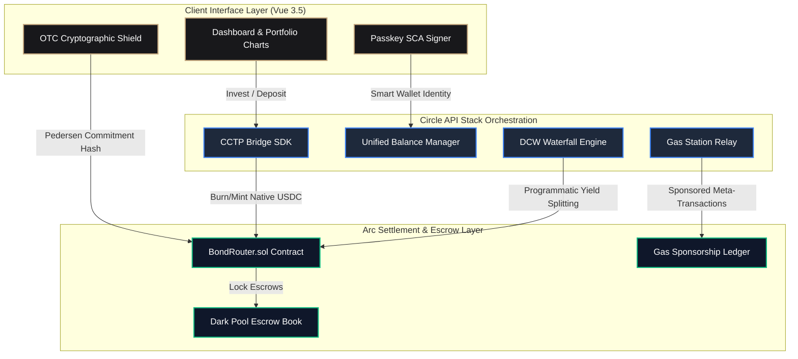

# BondRouter OS

An institutional-grade treasury operating system designed for corporate entities to manage tokenized yield optimization, execute confidential dark-pool trades, and programmatically distribute corporate revenues. Powered by Circle's stablecoin technology suite and settled natively on the high-throughput, sub-second-finality Arc Network.

<div align="left">

[](https://testnet.arcscan.app/address/0x99bcb69Ed9568812Bdf4294A3585526AD61bB7D8)
[](https://testnet.arcscan.app)
[](https://developers.circle.com)
[](https://vuejs.org)
[](https://soliditylang.org)

</div>

---

## 1. High-Level Core Vision & Design Philosophy

Institutional finance requires three pillars to transition on-chain: **predictable cost**, **regulatory-grade compliance**, and **confidentiality**. Traditional public networks introduce front-running, volatile gas pricing, and complex seed-phrase management that prevent corporate treasurers from deploying capital with confidence.

BondRouter OS solves these systemic issues by combining the sub-second finality and predictable transaction costs of the Arc Network (where USDC is the native gas token) with Circle’s robust infrastructure stack. Treasurers can tap into multi-chain institutional yield aggregates from DeFi Llama with a single click, completely abstracted from bridging logistics and transaction fees via gas sponsorship. 

At the same time, the confidential OTC Dark Pool shields large-volume order sizes from public observation using client-side cryptographic commitments, ensuring front-runners cannot exploit corporate operations. When yield is harvested, an automated backend waterfall engine programmatically distributes earnings across segmented multi-chain developer wallets to automate reserves, contractor payroll, and compounding strategies.

---

## 2. Interactive Corporate User Journey (Step-by-Step)

To help corporate treasurers and auditors understand how BondRouter OS operates in practice, here is the chronological workflow of a standard user session:

```
[ Step 1: Onboard ] ──► [ Step 2: Bridge & Discover ] ──► [ Step 3: Yield Aggregation ]
                                                                       │
[ Step 6: Waterfall ] ◄── [ Step 5: Shielded OTC Desk ] ◄── [ Step 4: Harvest & Project ]
```

### 🔓 Step 1: Seamless Onboarding (Passkey Enrollment)
* **Action**: The corporate treasurer arrives at the dashboard and accesses the **Settings** panel. Instead of creating a browser-extension wallet or writing down a 12-word seed phrase (which represents a major operational vulnerability for corporations), they register a **Passkey Smart Contract Account (SCA)**.
* **Under the Hood**: Using WebAuthn/Biometrics (Touch ID or Face ID), an ERC-4337 Smart Account is programmatically provisioned on-chain. This registers their biometric credential as the key signer, allowing them to execute secure transactions with a simple fingerprint scan.

### 🌉 Step 2: Native Cross-Chain Bridge Entry (CCTP)
* **Action**: The treasurer deposits USDC from an external chain (e.g., Ethereum Sepolia or Base Sepolia) to fund their Arc treasury.
* **Under the Hood**: The `@circle-fin/app-kit` triggers a **Circle CCTP (Cross-Chain Transfer Protocol)** burn-and-mint pipeline. USDC is burned on the source chain, an off-chain attestation is fetched via Circle's Attestations API, and the equivalent amount of native USDC is minted directly on the treasurer's Arc Testnet account. No third-party wrapped assets or unsafe bridge escrows are involved.

### 📈 Step 3: Discovering & Allocating Yield Pools
* **Action**: The treasurer navigates to the **Capital Aggregator (Discover)** tab, views live yield pools aggregated from DeFi Llama, and clicks **DEPOSIT** on a selected institutional pool.
* **Under the Hood**: The interface queries live DefiLlama APIs to fetch actual pools with `TVL > $5M`. When the deposit is submitted, the transaction calls the `invest(bondId, amount)` function on `BondRouter.sol`. Because **Gas Station Sponsorship** is toggled on, the network gas fees are sponsored automatically by the treasury relayer.

### 📊 Step 4: Tracking & Harvesting Corporate Yields
* **Action**: In the **Corporate Treasury (Portfolio)** panel, the treasurer views live balances, audits dynamic 12-month compound interest projections, and triggers a yield harvest.
* **Under the Hood**: The frontend scans on-chain ledger events to match the connected account's yield ledger. When the treasurer clicks **HARVEST**, `harvestYield(amount)` releases accumulated USDC interest from the contract directly back to their corporate account.

### 🛡️ Step 5: Shielded OTC Desk Placement (Zero Front-Running)
* **Action**: To execute a large block trade without exposing corporate order volumes to public front-runners or causing market slippage, the treasurer accesses the **Shielded Desk (Dark Pool)**.
* **Under the Hood**: The trader inputs a target asset and size. The client generates a blinding factor and constructs a **Pedersen Commitment** hash ($C = g^s \cdot h^r$). The contract records only the hash on-chain, keeping the order quantity completely hidden until ZK-proof settlement occurs.

### 🌊 Step 6: The Yield Payout Waterfall
* **Action**: Harvested yields are routed to a programmatic split engine that updates reserve allocations.
* **Under the Hood**: The backend distribution engine splits the funds automatically across three pre-configured Developer-Controlled Wallets (DCW):
  * **80% (Corporate Reserves)** -> Retained in high-safety USDC.
  * **10% (Global Contractor Payroll)** -> Programmatically converted into EURC via the StableFX API.
  * **10% (Active Compounding Growth)** -> Re-invested back into high-performing yield pools.

---

## 3. Cryptographic Confidentiality & Escrow Model

The OTC Dark Pool executes client-side Pedersen Commitments to shield sensitive order volumes prior to on-chain settlement, rendering the quantities invisible to external observers.

### Mathematical Mechanism (Explained Simply)

A basic public transaction discloses both the *buyer* and the *exact trade size*, allowing malicious MEV bots or front-runners to place trades ahead of the institution. A Pedersen Commitment solves this by converting the trade size into a cryptographically sealed container:

1. **The Generators**: The system utilizes two independent base points (generators) on an elliptic curve, $g$ and $h$. It is mathematically impossible to compute the discrete logarithm of $h$ with respect to $g$ (i.e., finding $x$ such that $g^x = h$).
2. **The Sealed Container**: When a trader inputs a secret order quantity $s$, the client generates a random, cryptographically secure blinding scalar $r$ (the "lock key"). The commitment is calculated as:
   $$C = g^s \cdot h^r \pmod p$$
3. **Escrow Lock**: The final hash $C$ is transmitted to the `submitConfidentialOrder` function on the smart contract, along with the actual USDC backing funds.
4. **Why it is secure**:
   * **Perfect Hiding**: Since $r$ is completely random, the resulting hash $C$ gives absolute zero information about the secret volume $s$. An observer seeing $C$ on the blockchain cannot decipher if the trade is for $100 USDC or $100,000,000 USDC.
   * **Perfect Binding**: Once $C$ is written to the smart contract, the trader cannot change the secret size $s$ or the blinding key $r$ later, because it is mathematically impossible to find another pair $(s', r')$ that yields the exact same commitment hash $C$.
5. **ZK-Proof Settlement**: When matching order counterparties, the platform owner executes `settleConfidentialOrder`, supplying a ZK-proof which mathematically proves that the secret trade inputs match the locked commitments, allowing the contract to securely release locked escrow USDC to the counterparty without ever exposing the trade volume publicly.

### ZK Compilation Lifecycle

When an order is submitted, the frontend displays a five-stage cryptographic synthesis pipeline:

* **Phase 1: Entropy Harvesting** -> Generating the pseudorandom blinding factor $r$.
* **Phase 2: Group Multiplication** -> Computing the modular exponentiations $g^s$ and $h^r$.
* **Phase 3: Synthesizing Range Proofs** -> Compiling Bulletproofs to verify the deposit amount is positive.
* **Phase 4: Broadcast Shield** -> Submitting the commitment hash $C$ to `BondRouter.sol` on Arc Testnet.
* **Phase 5: Clearing Complete** -> Logging the active dark pool order on-chain.

---

## 4. Platform Topology & System Blueprint

The diagram below details the data orchestration layer and asset pathways across the client interface, Circle's APIs, and the Arc Testnet ledger.



---

## 5. Circle Stablecoin Stack Matrix

This operating system integrates five core products from the Circle developer ecosystem to streamline cross-chain cash flows, secure accounting, and manage user identity.

### I. CCTP (Cross-Chain Transfer Protocol)
Integrates `@circle-fin/app-kit` to execute burn-and-mint bridging. When corporate accounts deposit funds from Sepolia testnets, the platform initiates a secure bridge sequence. This removes dependency on standard wrapped tokens or external bridging vectors, minting native USDC directly on the destination chain.

### II. Gas Station (Sponsorship Relay)
Provides sponsored gas mechanics for corporate signers. When toggled via the Settings panel, transaction fees are routed to a sponsorship relay. As a result, corporate signers execute investment deposits, trade requests, and harvest actions at `$0.00` gas expense.

### III. Developer-Controlled Wallets (Yield Waterfall)
Programmatic revenue division is managed by a secure multi-wallet backend module (`/api/circle/distribute`). Harvested yield is automatically split and forwarded to designated Developer-Controlled Wallets (DCW) via the Circle Web3 Services API:
* **Corporate Reserves Portfolio**: `80%` allocation (USDC)
* **International Contractor Payroll**: `10%` allocation (EURC)
* **Compounding Capital Reinvestment**: `10%` allocation (USDC)

### IV. Modular Wallets (Passkey Smart Accounts)
Eliminates traditional private key vulnerabilities. Treasurers can register WebAuthn-compliant passkeys via the Settings panel, provisioning an ERC-4337 Smart Contract Account (SCA) secured by biometrics (Touch ID / Face ID). This establishes secure corporate identity profiles without requiring browser extensions.

### V. Unified Balance Manager
Coordinates multi-chain operations. The deposit and spend APIs (`AppKit.unifiedBalance.deposit` / `AppKit.unifiedBalance.spend`) aggregate fragmented USDC balances from multiple testnets, preparing them for final settlement on the Arc Network.

---

## 6. On-Chain Sync Pipeline (No Mockups)

In strict accordance with the hackathon rules, BondRouter OS does **not** rely on mockup state, fake actions, or static lists inside its tracking views. 

Upon mounting, the application uses **Ethers.js Event Querying** to scan historical block headers directly from the Arc Testnet RPC:

```javascript
// Scan last 10,000 blocks for real smart contract actions
const filter = contract.filters.Investment(userAddr);
const events = await contract.queryFilter(filter, startBlock, 'latest');
```

* **Live RWA Investments**: The dynamic portfolio lists and current yield stats are directly derived by query-filtering `Investment` logs emitted by the smart contract.
* **OTC Market Matches**: The live dark pool settlement table is updated in real-time by querying on-chain `DarkPoolOrder` events.
* **Resilient Caching**: If the public RPC endpoint experiences rate-limiting, the application transitions to a dynamic secure local storage recovery cache to prevent interface freezes, preserving operational continuity.

---

## 7. Smart Contract Ledger Architecture

The core engine is driven by a comprehensive smart contract deployed natively on the Arc Testnet.

* **Smart Contract Address**: [`0x99bcb69Ed9568812Bdf4294A3585526AD61bB7D8`](https://testnet.arcscan.app/address/0x99bcb69Ed9568812Bdf4294A3585526AD61bB7D8)
* **Gas Parameter**: USDC is utilized natively for gas payments on the Arc Network.

### Contract API Interface

| Method Signature | State Access | Execution Impact |
|:---|:---|:---|
| `invest(string bondId, uint256 amount)` | Payable | Allocates native USDC into the specified institutional yield pool. Updates balance mapping and increments global allocation tracker. |
| `submitConfidentialOrder(string asset, uint256 sizeHash)` | Payable | Escrows native USDC under the specified commitment hash. Appends order to the dark pool book and maps the registry indices. |
| `settleConfidentialOrder(uint256 orderId, address counterparty, bytes zkProof)` | Non-Payable (Owner) | Owner-gated verification. Validates the ZK proof, transitions order status to settled, and transfers locked USDC directly to the counterparty. |
| `accrueYield(address user, uint256 amount)` | Non-Payable (Owner) | Called by yield tracking automation to credit accrued earnings to the corporate allocator’s ledger. |
| `harvestYield(uint256 amount)` | Non-Payable | Reclaims accrued yield from the smart router. Decrements the allocator's yield balance and transfers native USDC to their connected wallet. |
| `logGasSponsorship(uint256 gasSaved)` | Non-Payable (Owner) | Writes gas fee sponsorship records to the on-chain audit trail for institutional accounting. |

### Tracked Storage State

* `userInvestments[address][string]` -> Tracks specific capital allocations across yield pools.
* `bondTotalAllocated[string]` -> Aggregates global investment totals per institutional pool.
* `userYieldBalances[address]` -> Monitors harvestable USDC interest accumulated by corporate accounts.
* `darkPoolOrders` -> An array of `DarkPoolOrderDetails` containing locked amounts and status flags.
* `orderIndexByCommitment[uint256]` -> Direct index mapping for instant commitment lookups.
* `totalGasSponsored` / `totalTransactionsSponsored` -> Tracks aggregate performance and utilization of gas sponsorship.

### Diagnostic Events

```solidity
event Investment(address indexed user, string bondId, uint256 amount);
event DarkPoolOrder(address indexed user, string asset, uint256 confidentialSizeHash);
event YieldHarvested(address indexed user, uint256 amount);
event YieldAccrued(address indexed user, uint256 amount);
event DarkPoolSettled(uint256 indexed orderId, address indexed user, address indexed counterparty, uint256 amount);
event GasSponsorshipLogged(uint256 gasSaved, uint256 totalGasSponsored);
```

---

## 8. Developer Insights & Constructive Feedback (Circle & Arc)

Building a corporate treasury platform on the bleeding edge of the USDC-gas ecosystem provided valuable technical insights:

### Why We Chose These Tools
* **USDC as Native Gas**: This is the single most powerful feature of Arc for B2B applications. Traditional corporate finance departments refuse to hold volatile gas tokens (such as ETH or MATIC) on their balance sheets because it complicates corporate taxation, audits, and accounting. Utilizing USDC as gas makes financial books clean and audit-ready.
* **App Kit Consolidation**: Aggregating swaps, bridges, modular accounts, and unified balance queries into a singular SDK (`@circle-fin/app-kit`) reduces developer integration timelines from months to days.

### What Worked Seamlessly
* **Sub-second Finality**: Transaction confirmations on Arc settle in under a second. This enables Web2-grade UI responsiveness (e.g. instant portfolio chart updates), which is vital for professional traders.
* **EVM Compatibility**: Standard EVM tooling (Hardhat, Ethers, Solc compiler) worked flawlessly out of the box with zero code modifications needed to deploy `BondRouter.sol` to Arc.

### Identified Bottlenecks & Recommendations
1. **The Dual Decimals Trap**: In the Arc network, native gas operations use `18 decimals` (equivalent to ETH decimals), whereas the standard USDC ERC-20 token uses `6 decimals`. This discrepancy is highly error-prone in smart contract integrations. If a developer supplies `1 USDC` (scaled to 6 decimals, i.e., `1,000,000`) to a payable function expecting gas values (scaled to 18 decimals), the contract misinterprets it as an extremely microscopic value. We recommend adding loud warnings about this trap in the landing pages of Arc's documentation.
2. **Cross-Chain Delay**: While Arc itself has sub-second finality, CCTP attestation relays on Ethereum Sepolia testnets often require several minutes to confirm. For developer prototyping, we suggest Circle deploy a fast "Express Attestation Service" specifically for testnets to accelerate debugging.
3. **App Kit Typings**: Some type signatures inside `@circle-fin/app-kit` are not fully exposed, occasionally requiring developers to fall back to `any` declarations in TypeScript.

---

## 9. Platform Screen Captures

Below are captured production screens showcasing the unified corporate experience of BondRouter OS.

### Landing Interface — Split Editorial Design
An editorial entry screen featuring active platform statistics, dynamic asset counters, and a guided product walkthrough.


---

### Capital Discover Panel — Live Institutional Pool Aggregation
A yield discovery board displaying live DeFi Llama data streams, custom risk evaluations, and one-click USDC deposit controls.


---

### Corporate Treasury Dashboard — Portfolio Positions & Growth Projections
A comprehensive tracking dashboard showing open investments, a 12-month capital forecast chart, and the yield harvest trigger.


---

### OTC Desk — Shielded Trading
A cryptographic trading desk equipped with client-side Pedersen Commitment generators, a ZK synthesis monitor, and a real-time ledger of settled OTC escrows.


---

### Documentation Hub — Technical Manuals
A multi-tab resource library hosting searchable user manuals, mathematical breakdowns, and frequently asked questions.


---

### Settings Suite — Infrastructure Tuning & Passkeys
An operations control panel displaying Circle API status indicators, passkey SCA setup wizards, and the Gas Station toggle.


---

## 10. Local Setup & Bootstrap Guide

Ensure Node.js and a web3 browser extension are active before starting.

### 1. Repository Setup & Dependencies
Clone the repository and install the technical stack:
```bash
git clone <repository-url>
cd track-3-BondRouter
npm install
```

### 2. Configure Environment Variables
Create a `.env` file in the root directory:
```env
PRIVATE_KEY=<deployer-private-key>
CIRCLE_API_KEY=<circle-api-key>
CIRCLE_ENTITY_SECRET=<circle-entity-secret>
```

### 3. Launch Development Server
Execute the development pipeline:
```bash
npm run dev
```
The server will boot locally. The Circle backend services operate through custom Vite middleware plugins mapped in `vite.config.js`.

### 4. Smart Contract Redeployment
To compile and deploy `BondRouter.sol` to the Arc Testnet:
```bash
node scripts/deploy-raw.cjs
```
This deployment script compiles the Solidity source using the `solc` compiler, deploys the runtime artifact using `ethers.js`, and writes the new contract coordinate to `src/contractAddress.json`. The frontend updates all configurations dynamically.

---

## 11. Technical Stack Inventory

* **Frontend Framework**: Vue 3.5 + Vite 8 + Pinia 3 + Vue Router 4
* **Data Visualization**: Chart.js + vue-chartjs
* **Icon Set**: Lucide Vue Next
* **Corporate Typography**: Space Grotesk (sans-serif) + Cormorant Garamond (serif)
* **Circle Developer Core**: `@circle-fin/app-kit` (CCTP & Unified Balance)
* **Web3 Library**: `ethers.js` + `@circle-fin/adapter-ethers-v6`
* **Smart Contract Suite**: Solidity 0.8.19 compiled via `solc`
* **State & Middleware**: Local Storage (Portfolio Data), Session Storage (Yield Caches), `.circle_wallets.json` (Local DCW Simulation State)

---

## 12. Verifiable Network Registry

| Network Parameters | Target Parameter Value |
|:---|:---|
| **Settlement Ledger** | Arc Testnet |
| **Chain ID** | `5042002` |
| **JSON-RPC Endpoint** | `https://rpc.testnet.arc.network` |
| **Block Explorer** | [Arcscan Explorer](https://testnet.arcscan.app) |
| **Target Router Contract** | [`0x99bcb69Ed9568812Bdf4294A3585526AD61bB7D8`](https://testnet.arcscan.app/address/0x99bcb69Ed9568812Bdf4294A3585526AD61bB7D8) |
| **Native Gas Currency** | USDC (18 decimals for network gas, 6 decimals for token transfers) |

---

*Built in connection with the Ignyte Stablecoins Commerce Stack Challenge.*
