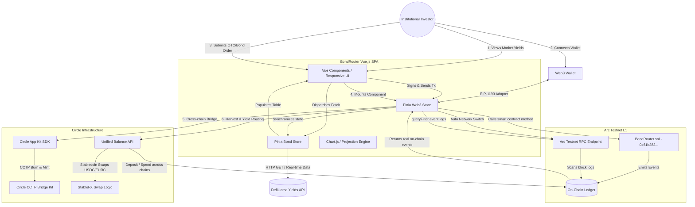

# BondRouter Technical Architecture 🏗️

This document outlines the professional system architecture, data flows, and technical modules of **BondRouter OS**—an institutional-grade treasury operating system built on the **Arc Testnet** and powered by the **Circle Developer Stack**.

---

## 📊 Complete System Architecture Diagram

---

## 🛠️ Core Engineering Modules

### 1. Market Telemetry Discovery (`stores/bond.js`)
* **Role:** Serves as the primary real-world asset aggregator.
* **Mechanism:** Fetches institutional-grade stablecoin yield pools live from the DefiLlama Yields API.
* **Optimization:** 
  * Filters out low-liquidity pools, requiring `TVL > $5,000,000` and positive `APY`.
  * Truncates the payload to the top 30 highest-yielding assets to eliminate UI rendering overhead.
  * Caches the fetched data in `sessionStorage` with a 1-hour Time-to-Live (TTL) to respect rate limits.

### 2. On-Chain Sync & Web3 Store (`stores/web3.js`)
* **Role:** Controls wallet interaction, RPC error routing, and real-time blockchain event queries.
* **Key Features:**
  * **Ethers.js Integration:** Leverages a `BrowserProvider` connected to the MetaMask/Wallet interface.
  * **Auto-Configuration:** Automatically prompts the wallet to switch to **Arc Testnet** (Chain ID: `5042002`, Hex: `0x4CEF52`).
  * **Dual Decimals Handling:** Strictly enforces 18-decimal parsing for native USDC gas payments and 6-decimal scaling for standard ERC-20 USDC transactions.
  * **Dynamic Event Log Scanning:** Connects to the smart contract at `0x61b2821a6C686498d0671e793c9d60F7791431bE` and calls `contract.queryFilter` to dynamically parse and display matching trades and portfolio additions. No mocked data or hardcoded arrays are used for client actions.

### 3. Circle App Kit & Cross-Chain Integration
* **Role:** Manages high-performance stablecoin bridging and currency exchange.
* **Supported Protocols:**
  * **Circle CCTP & Bridge Kit:** Wrapped under `@circle-fin/app-kit` to invoke secure, intent-based cross-chain USDC moves from external chains (e.g., Ethereum Sepolia) to Arc Testnet.
  * **Unified Balance API:** Integrates programmatic deposits from Base Sepolia/Arbitrum Sepolia and spent settlements directly onto Arc Testnet using the `@circle-fin/adapter-ethers-v6` wrapper.
  * **Swap (FX Conversion):** Executes USDC ↔ EURC exchange rate quotes for cross-border payroll/vendor settlements.

### 4. Interactive Analytics & Yield Waterfall (`Portfolio.vue`)
* **Role:** Visualizes future compound returns and automated payouts.
* **Mechanism:**
  * Uses **Chart.js** with responsive configurations to display a 12-month exponential growth projection based on the investor's weighted average portfolio APY.
  * Models a **Yield Waterfall Router** depicting how a corporate treasury automatically disperses yield: `80%` auto-bridged to Ethereum Sepolia, `10%` swapped to EURC for global contractor payouts, and `10%` re-compounded on Arc Testnet.

### 5. Premium Responsive UI Engine (`views/`)
* **Aesthetics:** Adheres strictly to the **Kraken** design system. Dark, high-contrast palette featuring toxic greens, gold highlights, and glassmorphism.
* **Responsiveness:** All tables are wrapped in responsive horizontal overflow containers with explicit text-overflow rules. They utilize absolute layout breakpoints, rendering elegantly on ultra-wide screens, tablets, and mobile devices.
