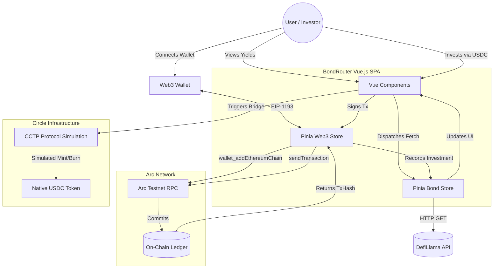

# BondRouter Architecture 🏗️

This document outlines the technical architecture and data flow of the BondRouter platform.

## System Diagram (Mermaid)

## Core Modules

### 1. Market Discovery (`stores/bond.js`)
* **Role:** Acts as the data aggregator.
* **Mechanism:** Fetches real-world stablecoin pool data from DefiLlama. 
* **Optimization:** Filters for USDC/DAI pools > $5M TVL. Slices data to 30 records to prevent DOM bloat and caches the parsed payload in `sessionStorage` with a 1-hour TTL.

### 2. Web3 Provider (`stores/web3.js`)
* **Role:** Manages blockchain interactions.
* **Mechanism:** 
  1. Initializes `BrowserProvider` via `ethers.js`.
  2. Forces network switch to Arc Testnet (`0x4CEF52`).
  3. Translates generic RPC errors into human-readable UI toasts.
  4. Generates an on-chain "Ping" transaction to the EVM Burn Address to generate a real `TxHash` on Arc Testnet, completely bypassing "External to Internal" EOA security restrictions.

### 3. CCTP Terminal Simulation (`Discover.vue`)
* **Role:** Demonstrates Track 3 requirements for Cross-chain functionality.
* **Mechanism:** A multi-step UI terminal that simulates the 3 phases of Circle CCTP (Burning USDC on Source Chain -> Attesting via Circle -> Minting USDC on Arc).

### 4. Yield Projection (`Portfolio.vue`)
* **Role:** User dashboard and analytics.
* **Mechanism:** Uses `Chart.js` to project a 12-month exponential yield curve based on the combined APY of the user's acquired bonds, reading local state persisted via Pinia.
